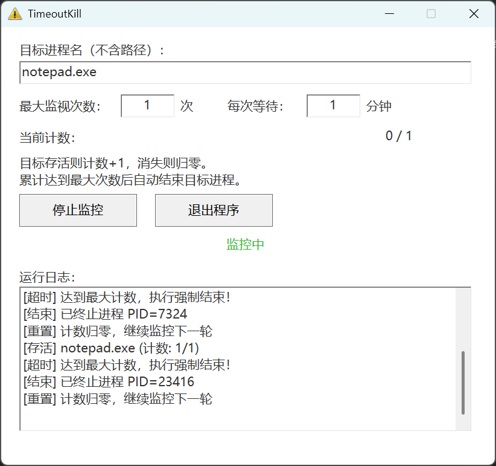

# TimeoutKill - 进程超时自动终止工具



## 功能

监控指定进程，连续运行超过设定时间后自动结束。

- 每隔固定时间检查一次目标进程是否存活
- 目标存活 → 计数 +1，目标消失 → 计数归零
- 累计达到最大次数 → 强制结束目标进程，并继续监控下一轮
- 进程名不区分大小写

## 使用方式

### GUI 模式

双击 `TimeoutKill.exe` 或右键以管理员身份运行，通过界面操作。

### 命令行模式

```
TimeoutKill.exe --help                                              显示帮助
TimeoutKill.exe --process <名称> --count <次数> --interval <分钟>   启动监控
```

```cmd
TimeoutKill.exe --process chrome.exe --count 10 --interval 5
```

命令行模式下按 **Ctrl+C** 随时停止监控。

## 安全特性

- **管理员权限**：通过 UAC manifest 自动请求提权
- **运行日志**：记录到 `TimeoutKill.log`（每次启动清空旧日志）
- **配置持久化**：`TimeoutKill.cfg` 自动保存上次参数

## 构建

### 前置要求

- Visual Studio 2022 + C++ 桌面开发组件
- CMake 3.20+

### 快速构建

双击 `build.bat`（自动检测并加载 VS 环境）。清理用 `clean.bat`。

### 输出

```
bin/TimeoutKill.exe              ← 自动复制的 Release 成品
build/bin/Release/TimeoutKill.exe
build/bin/Debug/TimeoutKill.exe  ← 调试版
```

## 技术栈

- C++20 / MSVC / Win32 API / CMake
- Per-Monitor V2 高 DPI 支持
- 白色线框 GUI 风格
- 命令行 + GUI 双模式（共享 MonitorThread）

## 文件说明

| 文件 | 说明 |
|------|------|
| `main.cpp` | 主程序源码 |
| `CMakeLists.txt` | CMake 构建配置 |
| `TimeoutKill.manifest` | UAC 管理员权限 + DPI 声明 |
| `build.bat` | 一键构建（自动加载 VS 环境） |
| `clean.bat` | 一键清理构建产物 |
| `image.png` | GUI 截图 |
| `.gitignore` | 忽略 build/ 和运行时文件 |
| `LICENSE` | 许可证 |

## 运行时生成

| 文件 | 说明 |
|------|------|
| `TimeoutKill.log` | 运行日志（每次启动清空重建） |
| `TimeoutKill.cfg` | 配置文件（保存上次参数） |
